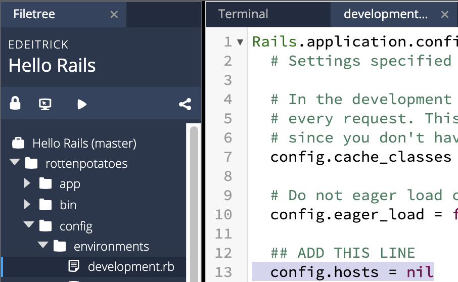
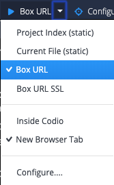

# Part 3: Create CRUD routes, actions, and views for Movies

If you are developing in Codio, we need to add a line of code to `config/environments/development.rb`.
Change this configuration option to match the following (if it exists) or add a new line:
 ```
config.hosts = nil
```



Open Terminal using `Tools > Terminal` and run the following command:
```shell script
rails server -b 0.0.0.0
```

To view your movies review site, use the Preview button that says `Project Index` in the top tool bar.
Click the drop down and select `Box URL`.



For subsequent previews, you will not need to press the drop down – your button should now read "Box URL".

If you now try the URI `https://your-codiobox-3000.codio.io/movies`, should get a Routing Error from Rails.
You can get `your-codiobox` from your terminal. When you open a new terminal, among the first few lines printed out,
you will see a line that matches the following format:
```shell script
* Your Codio Box domain is: [your-codiobox].codio.io
```
Indeed, you should verify that anything you add after the hostname part of the URI results in this error,
because we haven’t specified any routes mapping URIs to app methods. Try `rake routes`
and verify that it informs us that there are no routes in our brand-new app. (You may want to open multiple Terminal windows
or tabs so that the app can keep running while you try other commands.)

More importantly, use an editor to open the file `log/development.log` and observe that the error message is logged there;
this is where you look to find detailed error information when something goes wrong. 
We’ll show other problem-finding and debugging techniques later.

To fix this error we need to add some routes. Since our initial goal is to store movie information in a database,
we can take advantage of a Rails shortcut that creates RESTful routes for the four basic CRUD actions 
(Create, Read, Update, Delete) on a model. (Recall that RESTful routes specify self-contained requests of what operation to perform and what entity,
or resource, to perform it on.)

Edit `config/routes.rb`, which was auto-generated by the `rails new` command and is heavily commented.
Replace the contents of the file with this code (the file is mostly comments, so you’re not actually deleting much).
```
Rails.application.routes.draw do
  resources :movies
  root :to => redirect('/movies')
end
```


Save the `routes.rb` file and run `rake routes` again, and observe that because of our change to `routes.rb`,
the first line of output says that the URI `GET /movies` will try to call the `index` action of the `MoviesController`;
this and most of the other routes in the table are the result of the line resources `:movies`, as we’ll soon see. 
(As with many Rails methods, `resources 'movies'` would also work, but a symbol usually indicates one of a fixed set of choices rather than an arbitrary string.)
The root route `'/'`, RottenPotatoes’ “home page,” will take us to the main Movie listings page by a mechanism we’ll soon see called a `URL redirection`.

(If you want more practice with how the routes.rb contents get parsed into routes,
play around with the [Rails Routing Practice app](https://rails-routing-practice.herokuapp.com/) brought to you by ESaaS.)


Using convention over configuration, Rails will expect this controller’s actions to be defined in the class `MoviesController`,
and if that class isn’t defined at application start time, Rails will try to load it from the file `app/controllers/movies_controller.rb`.
Sure enough, if you now reload the page `https://your-codiobox-3000.codio.io/movies` in your browser, you should see a different error: `uninitialized constant MoviesController`.
This is good news: Rails is essentially complaining that it can’t find the `MoviesController` class, but the fact that it’s even looking for that class tells us that our route is working correctly!
As before, this error message and additional information are captured in the log file `log/development.log`.

To create both the controller file and associated views, we run the following command:
```
rails g scaffold_controller Movie title rating description release_date --skip-test
```
Notice the command above lists the model name (ie Movie) followed by the fields in movie records (ie title, rating, description and release date).

The `rails g` / `rails generate` commands provide a number of useful methods that can auto-generate scaffolding for basic `CRUD+I` operations.
You can check the list of all available commands on using `rails g --help`. Now you should have a working application even though the styling does not look too appealing.
To make the page more appealing, you need to incorporate CSS. You will see this in later assignments.


Now that the app is working, we would like to deploy it to production.

## Summary

You’ve used the following commands to set up a new Rails app:

1. `rails new` sets up the new app; the `rails` command also has subcommands to run the app locally (`rails server`) and other management tasks.

2. Rails and the other gems your app depends on (we added the Haml templating) are listed in the app’s `Gemfile`,
which Bundler uses to automate the process of creating a consistent environment for your app whether in development or production mode.

3. You created a database by running an initial migration to create
the first table, then adding seed data in `seeds.rb` to populate the
first few entries.  (In a real production app, you might or might not
need seed data; usually it's used for things like creating the initial
Admin account so that someone can login.)

4. To add routes in `config/routes.rb`, the one-line `resources` method provided by the Rails routing system allowed us to set up
a group of related routes for `CRUD+Index` actions on a RESTful resource (REST = Representational State Transfer).
The log files in the log directory collect error information when something goes wrong.
You may have noticed that after changing routes.rb, you didn’t have to stop and restart the app in order for the changes to take effect. 
In development mode, Rails reloads all of the app’s classes on every new request, so that your changes take effect immediately. 
In production this would cause serious performance problems, so Rails
provides ways to change various app behaviors between development and
production mode.

5. Then, we took advantage of Rails's scaffolding to automatically
generate (extremely simple) code for a controller and views that
actually implement the CRUD+I RESTful actions.

In the final part, we'll deploy the app to a production-quality PaaS (Platform
as a Service) in the cloud, namely Heroku.

<details>
    <summary>
        Recall the generic Rails welcome page you saw when you first created the app. In the `development.log` file,
        what is happening when the line Started GET “assets/rails.png” is printed? 
        (Hint: recall the steps needed to render a page containing embedded assets.)
    </summary>
    <blockquote>
        The browser is requesting the embedded image of the Rails logo for the welcome page.
    </blockquote>
</details>

<div align="center">
<b><a href="Part2.md">&larr; Previous: Part 2</a> &bull; <a href="Part2.md">Next: Part 4 &rarr;</a></b>
</div>
