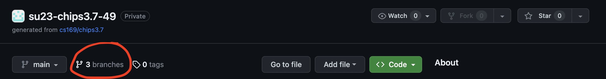
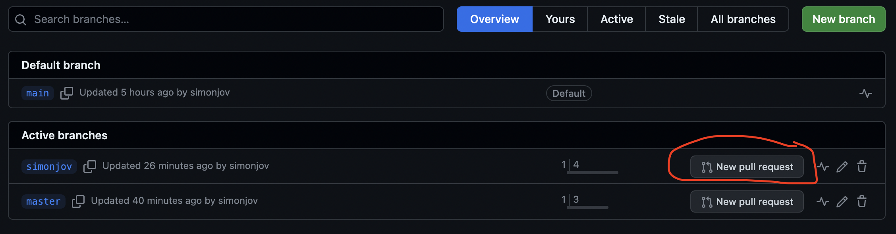
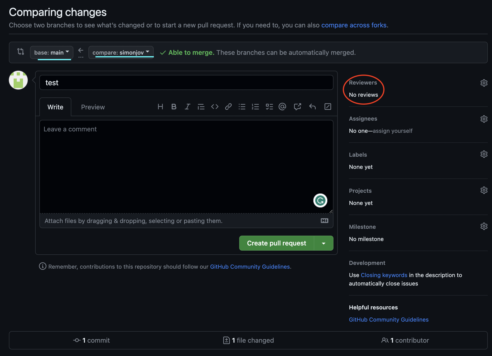

# Part 4: Deploy to the cloud, including the production database

## Change the database for production

In the Sinatra Wordguesser assignment, you already learned how to deploy a Sinatra app to Render. Deploying a Rails app is very similar, but a few extra steps are required since most Rails apps use databases.

All apps on Render use the PostgreSQL database. For Ruby/Rails apps to do so, they must include the `pg` gem. However, we don't want to use this gem while developing, since we're using SQLite for that. Gemfiles let you specify that certain gems should only be used in certain environments. Rails apps examine the environment variable `RAILS_ENV` to determine which environment they're running in, to make decisions such as which database to use (`config/database.yml`) and which gems to use. Render sets this variable to `production` at deploy time; running tests sets it to `test`; while you're running your app interactively, it's set to `development`.

To specify production-specific gems, you must make **two** edits to your Gemfile. First, add this:

```ruby
group :production do
  gem 'pg'
end
```

(If there is already a `group :production` in your Gemfile, just add those lines to it.)

Second, find the line that specifies the `sqlite3` gem, and tell the Gemfile that that gem should **not** be used in production, by moving that line into its own group like so:

```ruby
group :development, :test do
  gem "sqlite3", ">= 1.4"
end
```

This second step is necessary because Render is set up in such a way that the `sqlite3` gem simply won't work, so we have to make sure it is _only_ loaded in development and test environments but _not_ production.

As always when you modify your Gemfile, re-run `bundle install` and commit the modified `Gemfile` and `Gemfile.lock`. If it errors out, try `bundle config set without 'production'`. Note that bundler will remember the `without 'production'` option (check `.bundle/config`) so that you only need to run `bundle install` next time.

Also note that when you run Bundler, it will still compute dependencies and versions for gems in the `production` group, but it won't install them locally. Render will use `Gemfile.lock` to install the matching versions of the gems when you deploy.

**Don't we have to modify `config/database.yml` as well?**

**Yes!** Unlike Heroku, which used to automatically override this file, Render relies on your Rails configuration to tell it how to connect to the database. Currently, your project's default `production:` settings are pointing to a local SQLite database file, which will fail on Render.

Open `config/database.yml`, look at the bottom of the file for the `production:` section, and update it to use the `postgresql` adapter and read the `DATABASE_URL` environment variable like this:

```yaml
production:
  adapter: postgresql
  pool: <%= ENV.fetch("RAILS_MAX_THREADS") { 5 } %>
  url: <%= ENV['DATABASE_URL'] %>
```

This tells Rails that when it runs in production on Render, it must switch to a PostgreSQL database adapter and connect using the secret `DATABASE_URL` connection string that will be provided by your Render dashboard. Make sure to save, commit, and push this change to GitHub along with your Gemfile updates!

## Configuring the Render Build Script

Because we are using Render's Free Tier, we cannot run database commands manually from a terminal. Instead, we must tell Render to automatically migrate and seed our database during the application's **Build Phase**, which triggers **every single time you push code to GitHub.**

1. Look in your project folder under the `bin/` directory for a file named `render-build.sh`. (If it does not exist, create a file named `render-build.sh` inside the `bin/` directory).
2. Update or create the file so that it matches this script:

```sh
#!/usr/bin/env bash
# exit on error
set -o errexit

bundle install
bundle exec rails assets:precompile
bundle exec rails assets:clean

# Run database migrations and seed data automatically on deploy
bundle exec rails db:migrate
bundle exec rails db:seed
```

Make sure the script is executable by running `chmod +x bin/render-build.sh` in your terminal, then commit and push the changes to GitHub.

## Pull Request Instructions

Now that we've got all our app up and running locally and prepped the production environment database, it's time to get these changes on the main branch of your GitHub repo through a Pull Request (PR). First, make sure you have committed all of your changes so far to your branch, then push that branch to the GitHub remote as you did before.

You can create a PR directly through the GitHub site by clicking the "X branches" button near the top of the repo page.



From here, find your branch and click `New pull request`.



Now make sure that the base branch is `main` and that the compare branch is your own. Then add a title and a description of the changes you've made as well as any other info that you'd like your team to know about your PR. Once you create the PR, let your teammates know so that they can check out the changes and approve the PR.



Protocols vary from team to team, but in general, it is good practice to have at least 1 or 2 teammates review your changes to ensure that no bugs creep through to the merge. Once the reviews are in, all comments addressed, and any potential merge conflicts are resolved, you can merge in your changes!

Although every team member should make a pull request, only one team member needs to merge their code into the `main` branch. Once they have done that, in your terminal, checkout the `main` branch and pull in these new changes using `git checkout main && git pull origin main`.

---

## Deploy to Render

### Step 1: Create a PostgreSQL Database
1. Log into your [Render Dashboard](https://dashboard.render.com/).
2. Click **New +** at the top right and select **PostgreSQL**.
3. Give it a **Name** (e.g., `fa26-team-N-chip-4.8`) and select the **Free** plan.
4. Click **Create Database**. 
5. Once the database status changes to "Available", look for the **Connections** section and copy the **Internal Connection String** (it will start with `postgres://...`).

### Step 2: Create a Web Service
1. On the Render Dashboard, click **New +** and select **Web Service**.
2. Connect your GitHub repository.
3. Fill out these settings:
   * **Name:** `fa26-team-N-chip-4.8`
   * **Runtime:** `Ruby`
   * **Build Command:** `./bin/render-build.sh`
   * **Start Command:** `bundle exec puma -t 5:5 -p ${PORT:-3000} -e ${RACK_ENV:-production}`
   * **Plan:** `Free`
4. Scroll down to **Environment Variables**, click **Add Environment Variable**, and add these two pairs:
   * `DATABASE_URL` = *(Paste the Internal Connection String you copied in Step 1)*
   * `RAILS_MASTER_KEY` = *(Paste the contents of your local `config/master.key` file)*
5. Click **Create Web Service**.

Render will now pull your latest code from GitHub, execute your custom build script to migrate and cleanly reset the database data, and launch your application automatically using the Puma production server. If your build ever fails because you forgot to push a file, simply click the **Manual Deploy** drop-down at the top right of your Web Service page and select **Clear build cache and deploy** to try a clean rebuild!

Voila -- you have created and deployed your first Rails app!

<details>
<summary>
What are the steps you must take to have your app use a particular Ruby gem in production?
</summary>
<blockquote>
You must add the gem inside the <code>group :production</code> block in your <code>Gemfile</code>, remove it from any conflicting groups (like moving <code>sqlite3</code> to <code>:development, :test</code>), and then run <code>bundle install</code> locally to update your <code>Gemfile.lock</code> before committing and pushing to GitHub.
</blockquote>
</details>

<details>
<summary>
The <i>first</i> time you deploy a particular app on Render, what unique step must you take that isn't required for standard code-only repositories?
</summary>
<blockquote>
You must explicitly provision a separate PostgreSQL database instance on Render first, copy its <b>Internal Connection String</b>, and link it as an environment variable (<code>DATABASE_URL</code>) inside your Web Service's advanced settings so your Rails application knows where to find its production database.
</blockquote>
</details>

<details>
<summary>
When you make structural changes to your app (like adding a new database migration) or modify code logic, what sequence of steps must you take to <i>update</i> your live Render app?
</summary>
<blockquote>
Simply commit your changes to Git and push them to your GitHub repository. Because Render is linked directly to your GitHub repo, it will automatically detect the new commit, trigger a fresh build, run your <code>render-build.sh</code> script (which executes your new migrations safely), and redeploy your application automatically.
</blockquote>
</details>

---

[← Part 3: Create CRUD routes, actions, and views for Movies](04-Part-3--Create-CRUD-routes--actions--and-views-for-Movies.md) | [Contents](README.md) | [Submission →](06-Submission.md)
